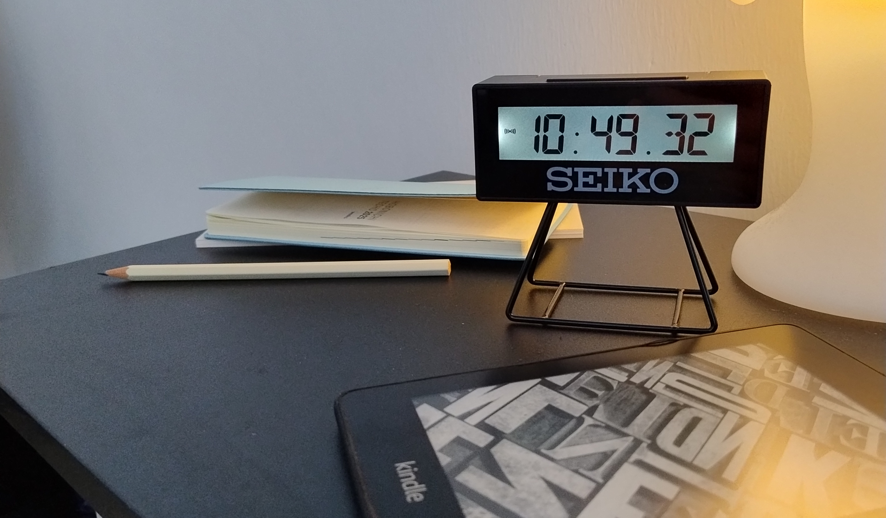
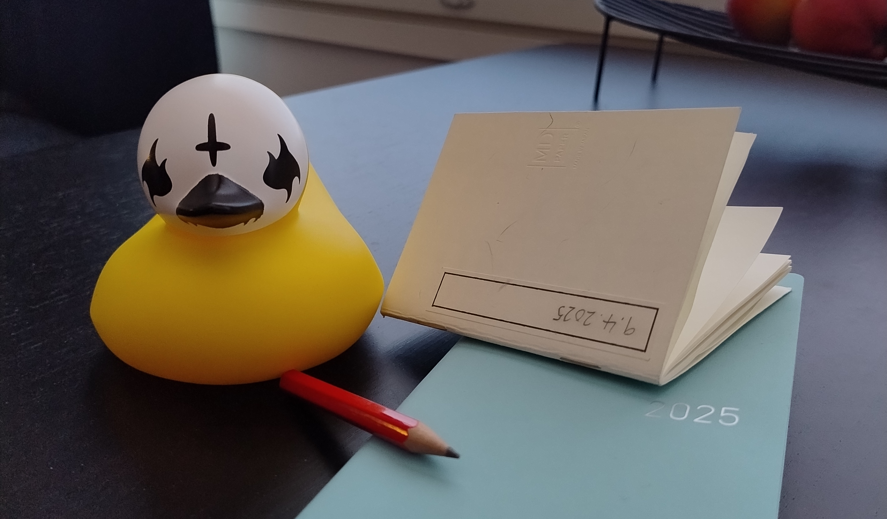
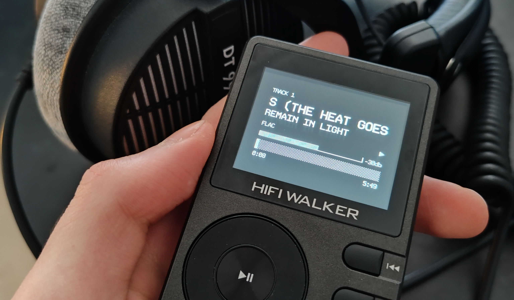

# Phone and I

Yeah I saw [that Eddy Burback video](https://www.youtube.com/watch?v=nnsyGSTKlw0). If you didn't, go watch it.

It's once in a blue moon that a youtube video inspires me. It's gotten rarer still over time, no doubt in part due to AI. But the problem is also with _me_.
This whole method of consuming content is absurd. I'm not looking for anything specific when I fire up youtube during a meal. I just don't want to hear myself chewing.
So you get less picky. More reactionary. You start avoiding things that require too much investment in favor of quick and easy _slop_.

Nothing new there and this isn't the point. We both know we're pissing away time when scrolling. Time shrinks with the large gaps in memory where living should have happened.
It's kind of hard to retroactively regret it either when you can't remember what you've lost.

So we've all tried it before. To _detach_. To take distance from the pandora's box and keep it at arm's length. It's always an impulsive decision, because it has to be. If you put it off, you're just
not going to do it. But this requires planning. A real catch-22.

The digital ecosystem has had years to grow into the most advanced skinner box of our time. Lots of thought and care has gone to ensure that you rely on it in every facet of your life. To keep you
crawling back, especially during the times when you're at your most vulnerable to suggestion.

Utility is an insidious thing. It begets reliance, which makes it a great tool for control. And to think it all started with a calculator.

## The everything tool

A timer, a clock, an alarm. To ensure your phone is the first and last thing you touch every morning and night. A calendar and a notebook, so you keep it with you, and rely on it to stay on track.
It's effortless to type your ideas down, and then develop them no further when you get distracted by a notification.

The phone also acts as a multimedia player with advanced algorithms catered to your tastes, to make sure you never decide another thing for yourself again. You take what you're fed or keep scrolling until you do.

If you decide to quit cold turkey, you will find yourself without alarm in the morning, without your books or music during the day, without your schedule or your notes. You'll be stranded and you'll have no choice but to return.

Communications, ironically, is the part I find least annoying about my phone. I think it's quite good in this regard—it's sole purpose in the distant past. I think that's the north star in this decoupling business. To restrict your phone to just this and the select
few functions it does well without demanding an exorbitant personal cost.

For the past couple of weeks I've been planning a coup d'etat. I'll go over my plans and their consequences in descending order of importance, because I respect your time. It's high time you should as well.

## Wake me up when my battery ends

Alarm clocks are kind of badass. It's a real wonder how we ever moved away from them. Get a sufficiently rustic one and you don't have to worry about it going off come hell or high water. No more sad swipes to snooze: smite that sucker!
No more worrying about notifications just to check the time—it's always sitting right there, in the same place as always. And what a bundle of personality! Unlike your gray-ass phone, an alarm clock can become part of your home decor.

The greatest gift is of course the reclamation of your time before and after bed. The times you're most liable to get lulled into consuming distracting garbage. Congratulations, you can wake up without your phone now.

 

## Read it and weep

This is a little more personal, but I can't fall asleep on command. If I go to bed with nothing but my thoughts, I'll keep thinking and won't stop. Books have been my solace in this regard. I used to read on my phone previously and that's no good, not
only because of reasons already mentioned above, but also the blue light that burns your eyes in the dark. [Something to do with cicadas](https://en.wikipedia.org/wiki/Circadian_rhythm) I heard. I was never one for physical books and a bedside lamp, but an e-reader works just as well. I take my kindle with me when I tuck
in for the night instead of my phone. Some nights I don't even open it, but it's there when I need it. Most importantly I'm in control of what's on it. I've planned ahead of time, made the decision of what book to install and ready. I decide.

## Scribe core

That bit earlier about being distracted while taking a note on my phone? That's happened more than once. It doesn't have to be a notification either. Just being on the phone, having picked it up, makes you pavlov's dog. You'll open tiktok whether coaxed or not.
And the thought dies there. A stub of what was meant to be. 

This one takes some adjusting to, but carry a notebook. A really small one, smaller than your phone even, and an equally small pencil to match. It's inconvenient, but also a little cute. It feels novel to pick up
pen and paper instead of typing, and you're certainly avoiding any undue distraction. There's also value in tactility (ironic after expressing my love for e-readers over books, I know). Instead of an endless list of notes or checkboxes, you have a more holistic idea of where
in space each idea or task resides. I keep a separate notebook for tracking exercise, and yet another on my workstation as a scratchpad.

 

## Fire your assistant

Digital calendars do too much. They're so convenient that you can entirely forget what day of what month it is at present. You can plan once, forget, and only remember once action is required by way of a reminder. It's awfully convenient, but it also makes the passage of time
vague. 

Outside the context of work, I find a physical calendar works much better. Not one of those that hangs off the wall, looming over you as if time itself doesn't do enough of that. Mine is a hobonichi techo. The same spiel about tactility applies here too. It feels great to plan your
future in a medium that doesn't restrict you to what the UX designer at Google thinks you should be able to do with it. You don't need reminders when you assume the responsibility to track your own time. I check my calendar every morning, and set an alarm on my bedside friend if
it's something I really can't miss. I suppose it depends on how much you schedule, but I found this to be a very easy and natural switch. Future reclaimed!

## Where song now slop

Music is a difficult one. Subscription-based streaming services have made music ownership an exceedingly niche hobby. Not so niche yet that we couldn't claw it back though.

MP3 players are still widely available, whether second-hand or freshly manufactured for audiophiles and enthusiasts. There's a community of these people who've built an open source firmware
replacement called [Rockbox](https://www.rockbox.org/) that can be installed on many of the more popular DAPs (digital audio players) out there. I bought the [HiFi Walker H2](https://hifiwalker.com/products/h2) and installed Rockbox with a theme called [Bones](https://themes.rockbox.org/index.php?themeid=3579&target=ipodvideo). It looks snazzy as hell. 

Music can be transferred in most common sound formats via USB, just like I already do with my e-reader.
Where to acquire this music though? This is where things get expensive. Most labels nowadays have a [Bandcamp](https://bandcamp.com/) page where you can purchase high quality FLACs and other lossless formats of their artists' albums, but the
cost is a far cry from the ten euro subscription you might be used to. You'll likely be spending that or more per album.

The upside is that you're supporting the artist in a much greater capacity than you ever could with a spotify subscription. You'll also own the music, in the best quality, forever.
I think even if you can only afford one or two of your favorite albums this can still be a good deal. Your options will be limited, yes, but that comes with it's own benefits. If you're sitting down for a session of focused studying, or want something to listen to while brushing your teeth,
it'll be much more freeing to leave your phone on its charger, and play an album you picked and bought.

Another option is to buy second-hand CDs from which you can extract files. This can be illegal depending on your jurisdiction so take that into consideration. As long as you own and keep the CD I don't see a moral issue with doing this over just listening to the CD itself.

A DAP is another statement piece with personality that no rectangular piece of glass can match. I also love having buttons and wheels and a screen that doesn't freak out when you spill water over it. Highly recommended if you're ready to invest some time into it and
treat it as a hobby.

 

## The burgeoning self

That's it for material things on my part. We've come a long way, but from here it's up to you alone. The single greatest predictor for if you're going to waste your time or not is if you have something meaningful to do. If you have nothing to fill your newly reclaimed time with, you'll end up wasting it all the same. Keeping busy is a cheat code for avoiding issues like this and lack thereof is likely what led you here in the first place. If you didn't have a social life in middle school, you spent that time playing games. Funny how small things like that cascade over the rest of your life. It's never too late to make a change though. Find something to do and you're already halfway there. 

And leave the phone. You don't need it anymore.

---

Sorry not sorry for the strange English your homeboy's been reading Tolkien as of late. I'll update you on how all this works in the long run at some point. See you later!

